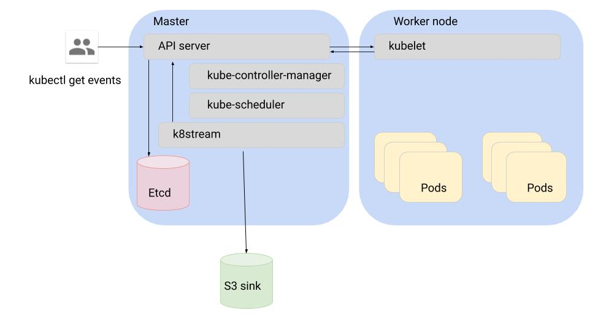

# K8stream [](https://opensource.org/licenses/Apache-2.0) [](https://travis-ci.com/last9/k8stream)


# Background

Kubernetes events are an excellent source of information to monitor and debug the state of your Services. Kubernetes API server emits events whenever there is a change in some resource it manages. These events are typically stored in etcd for some time and can be observed when you run kubectl get events or kubectl describe.

Typical metadata in every event includes entity kind (pod, deployment etc), state (warning, normal, error), reason and message.

There are no tools for running analytics on top of it to figure out root causes of outages. This is where k8stream comes in as a pipeline to ingest events.

# Overview

K8stream is a tool you can use to ingest Kubernetes events, **find their correlation with services under Impact**, and send them to a specified sink in batches.

## Principles

- Goal is to enable storing events for post-hoc analysis
- Pods are cattle, Services are Pets. Any change in cluster should find its association with the Service under Impact. 
- The overhead to the cluster should be minimal
- All queries should be cached
- This processor does not handle deduplication and out of order events
- Events stored in the sink should be batched

## Non Goals

- This does not provide a UI or a queryable interface
- The storage is provided by the sink

# Setup

### Build

```bash
make build
```

This should output a ./k8stream binary in the TLD of the repository.

### Run

```bash
./k8stream --config=config.json
```

### Configuration

Typical configuration looks like:

```javascript
{
  "config": {
    "uid": "719395d7-4e91-4817-a6ec-9a8ded29bebc", // UID of this deployment
    "heartbeat_hook": "https://sample.last9.io", // Heatbeat hook
    "heartbeat_interval": 60,     // Send a heartbeat signal.
    "batch_interval": 60,         // Flush every n seconds
    "batch_size": 10000,          // Flush every n events
    "sink": "s3"                  // Choices "s3", "file", "memory"
  },
  "namespaces": ["default"], // Skip this key if all namespaces should be captured. By default, kube-system, kubernetes, kubernetes-dashboard are always skipped
  "prefix": "local/test-upload",  // Prefix of S3 Upload
  "aws_region": "ap-south-1",     // Region of S3 bucket
  "aws_bucket": "last9-trials",   // S3 Bucket to Upload to
  "aws_profile": "last9data",     // Profile, in case using creds file
  "aws_access_key": "1",          // Explicit AccessKey (Not advised)
  "aws_secret_access_key": "2",   // Explicit SecretKey (Not advised)
  "kubeconfig": ""                // Location to kubeconfig file, leave empty when deploying to K8s
}
```

### Deploy

There is a deployment file available at [K8s YAML file](deploy/k8stream.yaml)

In case on in-cluster deployment omit the "kubeconfig" parameter in JSON.
Setting this as empty the code falls back to in-cluster authorization.

# Detailed Design



## Handling of events

- Doesn't perform an event-by-event upload but instead uploads in batches
- K8s stream handles some basic de-duplication of events by checking the event cache if this entry has been processed.  However, if the cache gets flushed or the k8stream binary gets restarted, it will start processing duplicate events.
- The events are enriched with more metadata such as labels and annotations corresponding to the entity, node IP address etc.
- Uses a highly concurrent Cache to avoid re-lookup.

## Writing to sink

- Uses asynchronous batching to write to Sink (only S3, File outout are supported for now)
- Events are marshalled using protobuf.
- Data written to sink is gzipped.
- Avoids any local/intermediate files.
- Resync allows to catch up with the Event stream if its lost momentarily.

# Limitations

- Because events from K8s can arrive out of order, though we try our best to de-deduplicate and order them, it cannot be guaranteed. It's advised to handle deduplication and ordering at consumer end.
- K8stream does not handle the case of duplicate events after  a restart. This is because the only deduplication that happens currently is by reading the local cache which gets flushed on a restart. This needs to be handled by the consumer of the stream.
- This currently only supports writing to S3 and file output.

# Future Work

- [X] Support for adding POD details to an event
- [X] Support for writing to more output streams
- [X] Adding more metadata like service name for the event
